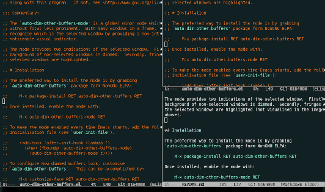

# auto-dim-other-buffers.el

The `auto-dim-other-buffers-mode` is a global minor mode which makes
windows without focus less prominent.  With many windows in a frame,
the idea is that this mode helps recognise which is the selected
window by providing a non-intrusive but still noticeable visual
indicator.

The preferred way to install the mode is by grabbing
`auto-dim-other-buffers` package form MELPA:

    M-x package-install RET auto-dim-other-buffers RET

Once installed, the mode can be turned on (globally) with:

    M-x auto-dim-other-buffers-mode RET

To make the mode enabled every time Emacs starts, add the following to
Emacs initialisation file (`~/.emacs` or `~/.emacs.d/init.el`):

    (add-hook 'after-init-hook (lambda ()
      (when (fboundp 'auto-dim-other-buffers-mode)
        (auto-dim-other-buffers-mode t))))

To configure how dimmed buffers look like, customise
`auto-dim-other-buffers-face`.  This can be accomplished by:

    M-x customize-face RET auto-dim-other-buffers-face RET

More customisation can be found in `auto-dim-other-buffers`
customisation group which can be accessed with:

    M-x customize-group RET auto-dim-other-buffers RET

Note that despite it’s name, since Emacs 27.1 the mode operates on *windows*
rather than buffers.  I.e. selected window is highlighted and all other
windows are dimmed even if they display the same buffer.
